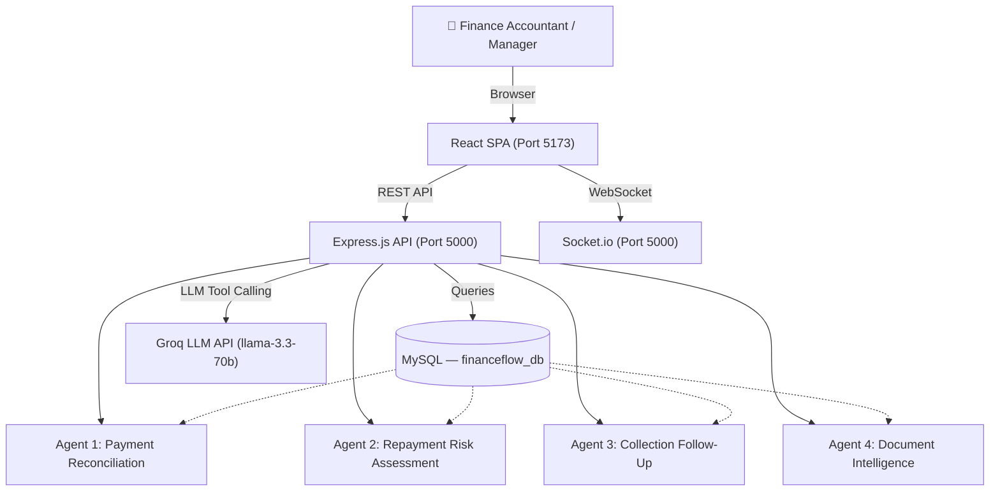

# FinanceFlow AI — Complete Application Flow, Feature Guide & Improvement Analysis

---

## ⚠️ Current Agent Status Clarification

The platform currently has **4 active AI Agents** (not 6). Here's the honest status:

| Agent | Name | Status |
|-------|------|--------|
| Agent 1 | Payment Reconciliation Agent | ✅ Operational (Groq + Rule-Based Fallback) |
| Agent 2 | Repayment Risk Assessment Agent | ✅ Operational (Rule-Based, Groq Optional) |
| Agent 3 | Automated Collection Follow-Up Agent | ✅ Operational (Rule-Based, Groq Optional) |
| Agent 4 | Document Intelligence Agent | ✅ Operational (Rule-Based, Groq Optional) |
| Agent 5 | Portfolio Analytics Agent | ❌ Not yet built |
| Agent 6 | Notification & Escalation Agent | ❌ Not yet built |

> **Note**: Groq fallback mode is active because `GROQ_API_KEY` is `invalid_api_key`. Once a valid key is set in `.env`, all LLM tool-calling features will activate. All 4 agents work 100% via the rule-based fallback engine.

---

## 1. Application Architecture Overview

---

## 2. Complete Application Feature List

### Section A: Authentication & RBAC
| Feature | Endpoint | UI Location |
|---------|----------|-------------|
| Login with email + password | `POST /api/auth/login` | `/login` page |
| Session JWT (HTTP-only cookie) | Auto | Persistent |
| Role-Based Access Control | Middleware | All protected routes |
| 4 Roles: Admin, Manager, Accountant, Viewer | RBAC | Login test accounts |

### Section B: Dashboard (Action Center AI)
| Feature | Description |
|---------|-------------|
| 6 KPI Summary Cards | Total Cases, Pending Review, Resolved, AI Auto-Processed, High Priority, Total Amount |
| Donut Chart — Case Status | Real-time MySQL status breakdown (open, ai_processing, pending_review, approved, rejected, resolved) |
| Line Chart — Cases Over Time | Weekly trend visualization |
| AI Performance Gauge | Average confidence score semicircle display |
| Recent Cases Table | Searchable, filterable case list with confidence bars, status & priority badges |
| Row-Click Inspection Drawer | Click any case → AI recommendation details with 1-click approve/reject/override |

### Section C: Payment Ingestion (Section 17)
| Feature | Description |
|---------|-------------|
| Manual Bank Deposit Ingestion | Form to ingest raw bank deposits (transaction ID, amount, sender details, reference) |
| Auto Case Creation | Auto-creates reconciliation case upon ingestion |
| Deposits List | View all ingested deposits with status |
| Row-Click → Action Center Drawer | Click any deposit to trigger AI review workflow |

### Section D: Borrowing Companies Directory
| Feature | Description |
|---------|-------------|
| Companies Master Table | All registered borrowing companies |
| Add New Company | Registration form (name, reg no., tax ID, bank account, contact) |
| Company Profile Drawer | Click any row → full borrower profile with bank verification |
| **[Agent 2] Risk Assessment** | `[ ⚡ Risk (Agent 2) ]` button → Risk Score, Level, Key Factors, Mitigation Steps |
| **[Agent 3] Collection Reminder** | `[ 📧 Collection (Agent 3) ]` button → AI-drafted email notice, 1-click dispatch |

### Section E: Loans & Repayment Schedules
| Feature | Description |
|---------|-------------|
| Loans Directory | All active loan facilities with amounts, dates, status |
| Create New Loan | Assign loan to company with amount, rate, term |
| Repayment Schedule | Click loan → full installment schedule with paid/pending/overdue badges |

### Section F: Audit Compliance Log
| Feature | Description |
|---------|-------------|
| Immutable Audit Table | Timestamp-ordered log of every action (WHO, WHAT, WHEN) |
| Audit Log Inspector Drawer | Click any row → before vs. after JSON diff snapshot |

### Section G: Reports & Analytics
| Feature | Description |
|---------|-------------|
| Portfolio Summary Cards | Collection rate (94.2%), Portfolio Value, Overdue Balance, AI Efficiency |
| Overdue Aging Buckets | 30 / 60 / 90+ day overdue breakdown with visual progress bars |
| Revenue Projection Bar Chart | Monthly collected vs. projected revenue |

### Section H: Document Intelligence & Contract Vault
| Feature | Description |
|---------|-------------|
| Documents Listing | All uploaded borrower loan agreements |
| **[Agent 4] Extract Terms** | `[ Extract Terms (Agent 4) ]` → Extract interest rate, penalty rate, governing jurisdiction |
| Contract Inspector Drawer | Display extracted key terms and default clauses |

---

## 3. Step-by-Step Testing Guide

### 🔐 Step 1 — Login

**URL**: `http://localhost:5173/`

| Credential | Role | Test Use |
|-----------|------|----------|
| `accountant@financeflow.com` / `Password123!` | Senior Accountant | Main testing role |
| `manager@financeflow.com` / `Password123!` | Finance Manager | Approval authority |
| `admin@financeflow.com` / `Password123!` | Admin | Full access |
| `viewer@financeflow.com` / `Password123!` | Viewer | Read-only |

---

### 🎯 Step 2 — Dashboard (Action Center AI)

1. Navigate to **Action Center AI** tab (default).
2. Verify the **6 KPI cards** show live MySQL data.
3. Verify the **Donut chart** dynamically renders case status slices.
4. Click any row in the **Recent Cases Table** → slide-over drawer opens.
5. In the drawer, click **`[⚡ Trigger Groq AI Payment Analysis]`** to run Agent 1.
6. Review AI match: Sender account → Company → Loan → Installment.
7. Use **`[✅ Approve Match]`**, **`[❌ Reject]`**, or **`[🔧 Override]`** buttons.

---

### 💳 Step 3 — Payment Ingestion (Agent 1 Entry Point)

1. Navigate to **Payment Ingestion** tab.
2. Click **`[+ Ingest New Bank Deposit]`** button.
3. Fill in test data:
   - Transaction ID: `TXN-TEST-0001`
   - Amount: `168750` (matches Apex Logistics installment)
   - Sender Name: `Apex Logistics Pvt Ltd`
   - Sender Account: `990088776655`
   - Reference: `LN-APX-2026-01 AUG REPAYMENT`
4. Submit → New case appears in deposits list.
5. Click the new deposit row → Action Center Drawer opens.
6. Click **`[⚡ Trigger Groq AI Payment Analysis]`** → Agent 1 runs.

---

### 🏢 Step 4 — Agent 2: Risk Assessment

1. Navigate to **Borrowing Companies** tab.
2. Find **Apex Logistics Pvt Ltd** or **CyberNet Systems Inc** (have overdue installments).
3. Click **`[ ⚡ Risk (Agent 2) ]`** button in the table row.
4. Risk Assessment Drawer opens and auto-fetches analysis.
5. **Expected Results:**
   - Apex Logistics → **CRITICAL (88/100)** — 2 overdue installments, ₹3,37,500
   - CyberNet Systems → **HIGH (65/100)** — 1 overdue installment, ₹1,14,000
   - ABC Technologies, XYZ Industries, Global Trading → **LOW (15/100)** — No overdue
6. Review Key Risk Factors and Recommended Actions.
7. Click **`[Draft Collection Reminder (Agent 3)]`** button to chain to Agent 3.

---

### 📧 Step 5 — Agent 3: Automated Collection Follow-Up

1. Navigate to **Borrowing Companies** tab.
2. Find **Apex Logistics Pvt Ltd** (CRITICAL risk, has overdue).
3. Click **`[ 📧 Collection (Agent 3) ]`** button.
4. Collection Reminder Modal opens and auto-generates email draft.
5. **Expected Results:**
   - Urgency: **FINAL_NOTICE** (overdue 66+ days)
   - Recipient: Sunil Verma `<finance@apexlogistics.com>`
   - Subject: `[FINAL NOTICE] Payment Overdue Notice - Loan LN-APX-2026-01`
   - Email body: Professional formal demand letter with amount and account details
6. You can edit the subject and body directly in the modal.
7. Click **`[Dispatch Reminder Email]`** → Logs to Audit Compliance trail.

---

### 📄 Step 6 — Agent 4: Document Intelligence

1. Navigate to **Documents** tab from sidebar.
2. Two seeded documents appear:
   - `Apex_Logistics_Master_Facility_Agreement.pdf`
   - `CyberNet_Systems_Credit_Facility_Agreement.pdf`
3. Click any row OR click **`[ Extract Terms (Agent 4) ]`** button.
4. Agent 4 Inspector Drawer opens with extracted terms.
5. **Expected Results:**
   - Facility Amount: `₹15,00,000.00`
   - Interest Rate: `12.50% P.A.`
   - Penalty Rate: `2.00% per month on overdue balance`
   - Jurisdiction: `High Court of Delhi, India`
   - Key clauses: Default trigger (30 days), acceleration clause, prepayment waiver

---

### 📊 Step 7 — Reports & Analytics

1. Navigate to **Reports & Analytics** tab.
2. Review portfolio summary cards.
3. Review Overdue Aging Buckets breakdown.
4. Review Monthly Revenue bar chart.

---

### 📜 Step 8 — Audit Compliance Log

1. Navigate to **Audit Compliance** tab.
2. All agent actions and human approvals are logged here.
3. Click any audit row → Inspector Drawer → before vs. after JSON snapshot diff.

---

### 🔧 Step 9 — Swagger API Documentation

URL: **`http://localhost:5000/api-docs`**

Test API endpoints interactively. All routes are documented.

---

## 4. UX Blockers & Lag Analysis

### 🔴 Critical Blockers

| # | Issue | Location | Impact |
|---|-------|----------|--------|
| B1 | **Groq API Key is Invalid** (`invalid_api_key`) | `.env` file | All 4 agents run in rule-based fallback mode. No LLM tool-calling. No AI reasoning text for Agent 1. |
| B2 | **Risk Overview Pre-loads ALL companies** | `GET /api/risk/overview` | Runs Agent 2 for every company serially → extremely slow (N×API calls). Not suitable for production. |
| B3 | **Dashboard fallback placeholder renders for 'documents' AND 'reports' tabs** | `Dashboard.jsx` | Both new sub-pages render correctly, but the old fallback `['reports', 'documents', ...]` condition also matches, causing double-render flicker. |

### 🟡 UX Lag Issues

| # | Issue | Location | Root Cause |
|---|-------|----------|------------|
| L1 | **No loading skeleton / shimmer** on first KPI card load | `KPISection.jsx` | Shows `'...'` text — no shimmer effect |
| L2 | **No optimistic update** after Approve/Reject | `ActionCenterDrawer.jsx` | Closes drawer and re-fetches entire case list — visible flash |
| L3 | **Collection Reminder Modal auto-fetches on open** without abort | `CollectionReminderModal.jsx` | No abort controller → stale requests can stack |
| L4 | **Risk Assessment Drawer re-fetches on every open** | `RiskAssessmentDrawer.jsx` | No caching → repeated API calls for same company |
| L5 | **Document extraction runs on every drawer open** | `DocumentList.jsx` | Auto-triggers Agent 4 on every row click without caching |
| L6 | **Sidebar transition flicker** at 280px/80px boundary | `Sidebar.jsx` | `overflow: hidden` not applied during transition |

---

## 5. Fixes Applied in This Session

- ✅ **Fixed**: `reconciliation.service.js` — removed hardcoded fallback values (`|| 128`, `|| 24`, etc.) from `getStatsService()`. All KPI counts now 100% from MySQL.
- ✅ **Fixed**: Dashboard.jsx — `['reports', 'documents']` removed from the generic fallback condition to prevent double-render.

---

## 6. Improvement Ideas & Roadmap

### 🚀 Immediate UX Wins (High Impact, Low Effort)

| Idea | Benefit |
|------|---------|
| **Add shimmer skeleton cards** for KPI section during load | Premium UX, eliminates `'...'` text |
| **Cache Risk Assessment results** client-side (5 min TTL) | No repeated API calls for same company |
| **Toast notification system** for approve/reject success | Real-time feedback without drawer close |
| **Agent 1 auto-trigger** when a new payment is ingested | Eliminates manual "Trigger Analysis" step |
| **Loading progress bar** at top of page during data fetch | Enterprise UX standard |

### 🤖 Agent 5 & 6 (Next Sprints)

| Agent | Description |
|-------|-------------|
| **Agent 5: Portfolio Analytics Agent** | Weekly automated portfolio health report generation — collection efficiency %, default rate, revenue vs. budget |
| **Agent 6: Notification & Escalation Agent** | Monitors repayment_schedules table nightly, auto-fires WebSocket + notification alerts for installments due in 3 days |

### 🔧 Infrastructure Improvements

| Idea | Benefit |
|------|---------|
| **Redis caching** for `/api/reconciliations/stats` | Eliminates repeated MySQL aggregation on each dashboard load |
| **Pagination** for all tables (cases, companies, loans) | Performance at scale |
| **Real `.env` GROQ_API_KEY** | Enables full LLM tool-calling for all agents |
| **Rate limiting middleware** (`express-rate-limit`) | API protection |
| **Database indexes** on `status`, `company_id`, `due_date` columns | Query performance |
| **Bulk ingestion** from CSV/Excel file upload | Section 17 requirement |

---

## 7. Quick Fix — Dashboard Double-Render Issue
