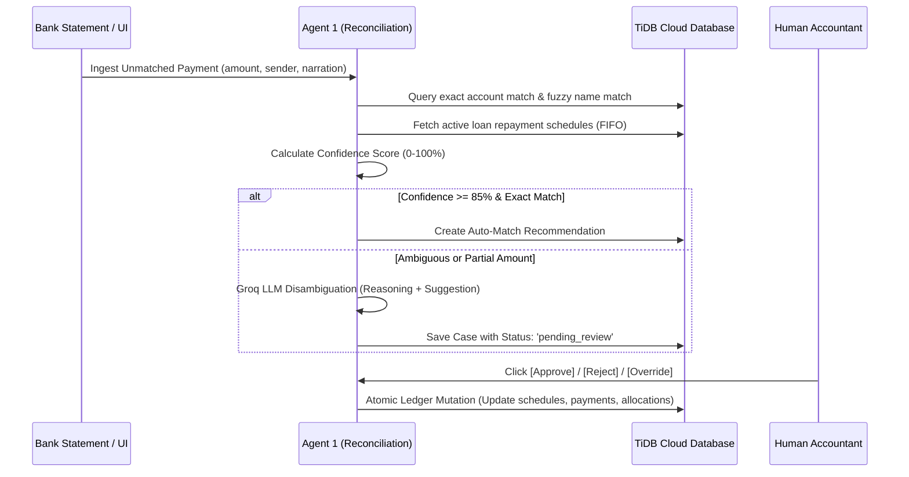

# FinanceFlow AI — Multi-Agent System Architecture & Assessment Specification

---

## Executive Overview
**FinanceFlow AI** is an enterprise-grade agentic financial operating platform designed for non-banking financial companies (NBFCs), debt syndicates, and corporate loan service desks. It automates high-volume bank statement reconciliation, credit risk surveillance, borrower communications, document OCR, portfolio concentration analytics, and executive escalation governance.

The platform orchestrates **6 Autonomous AI Operational Agents** alongside a **Copilot Conversational Assistant**, combining deterministic SQL/financial math engines with Groq-powered large language models (**`llama-3.3-70b-versatile`** and **`qwen-2.5-32b`**) for human-in-the-loop agentic workflows.

```
                                  ┌──────────────────────────────────────────────┐
                                  │      FinanceFlow AI Orchestration Core       │
                                  └──────────────────────┬───────────────────────┘
                                                         │
         ┌───────────────────┬───────────────────┼───────────────────┬───────────────────┬───────────────────┐
         ▼                   ▼                   ▼                   ▼                   ▼                   ▼
   ┌───────────┐       ┌───────────┐       ┌───────────┐       ┌───────────┐       ┌───────────┐       ┌───────────┐
   │  AGENT 1  │       │  AGENT 2  │       │  AGENT 3  │       │  AGENT 4  │       │  AGENT 5  │       │  AGENT 6  │
   │Reconcile &│       │Credit Risk│       │Collection │       │ Document  │       │ Portfolio │       │Escalation │
   │Settlement │       │  & EWS    │       │ & Notices │       │ Extraction│       │ Analytics │       │Governance │
   └───────────┘       └───────────┘       └───────────┘       └───────────┘       └───────────┘       └───────────┘
```

---

# Table of Contents
1. [Agent 1: Payment Reconciliation & Ledger Settlement Agent](#agent-1-payment-reconciliation--ledger-settlement-agent)
2. [Agent 2: Credit Risk Assessment & Early Warning Surveillance (EWS) Agent](#agent-2-credit-risk-assessment--early-warning-surveillance-ews-agent)
3. [Agent 3: Autonomous Collections & Multi-Tier Notice Generator Agent](#agent-3-autonomous-collections--multi-tier-notice-generator-agent)
4. [Agent 4: Financial Document Extraction & OCR Parsing Agent](#agent-4-financial-document-extraction--ocr-parsing-agent)
5. [Agent 5: Portfolio Health & Concentration Risk Analytics Agent](#agent-5-portfolio-health--concentration-risk-analytics-agent)
6. [Agent 6: Notification & SLA Escalation Governance Agent](#agent-6-notification--sla-escalation-governance-agent)
7. [AI Copilot: Conversational Natural Language Assistant](#ai-copilot-conversational-natural-language-assistant)
8. [Comprehensive Test Scenarios & Assessment Matrix](#comprehensive-test-scenarios--assessment-matrix)

---

# Agent 1: Payment Reconciliation & Ledger Settlement Agent

### 1. Identity & System ID
* **Agent Identifier**: `agent_1_reconciliation`
* **Agent Role**: Autonomous Bank Deposit Matcher & Financial Settlement Engine
* **Execution Paradigm**: Hybrid Deterministic Matching + LLM Semantic Disambiguation + Human-in-the-Loop Approval

### 2. Business Problem Solved
In corporate lending, thousands of bank statement line items arrive daily with truncated narration (e.g. `NEFT-AXIS-009827-APX-CORP`), unlinked virtual accounts, partial amounts, or split bulk payments. Human accountants spend 4–8 hours manually matching payments against schedules, leading to delayed ledger updates and compliance breaches.
**Agent 1 solves this** by executing multi-tier deterministic matching (fuzzy company name, account number, amount, invoice ref), analyzing unmatched deposits with LLM reasoning, allocating payments across repayment schedules (FIFO principle), and maintaining ledger audit rollbacks.

### 3. Technical Configuration
* **LLM Engine**: Groq API (`llama-3.3-70b-versatile` / `qwen-2.5-32b`)
* **Temperature**: `0.1` (Strict, deterministic financial reasoning)
* **Max Tokens**: `2,048`
* **Lock Key**: `RECON_PAYMENT_{payment_id}` (prevents double settlement race conditions)
* **System Prompt**: `RECONCILIATION_AGENT_SYSTEM_PROMPT`
* **Tools Used**:
  * `findBorrowingCompanyByAccount`: Looks up company by bank account number.
  * `searchBorrowingCompaniesByName`: Fuzzy search across registered corporate names.
  * `findActiveLoans`: Retrieves open loans and pending repayment schedules.
  * `calculateScheduleAllocations`: Computes FIFO installment principal & interest allocations.

### 4. Data Sources & Schema Dependencies
| Table | Columns Used | Operation |
| :--- | :--- | :--- |
| `payments` | `id`, `amount`, `payment_date`, `sender_name`, `sender_account_number`, `bank_reference`, `status` | READ / UPDATE |
| `companies` | `id`, `company_name`, `bank_account_number`, `registration_number`, `tax_identifier` | READ |
| `loans` | `id`, `company_id`, `loan_number`, `principal_amount`, `total_payable`, `status` | READ |
| `repayment_schedules` | `id`, `loan_id`, `installment_number`, `due_date`, `scheduled_amount`, `paid_amount`, `status` | READ / UPDATE |
| `reconciliation_cases` | `id`, `payment_id`, `company_id`, `loan_id`, `status`, `ai_confidence_score`, `ai_reasoning` | INSERT / UPDATE |
| `payment_allocations` | `id`, `case_id`, `schedule_id`, `allocated_amount`, `allocation_type` | INSERT / DELETE |

### 5. Detailed Execution Flow


### 6. Test Cases & Verification Scenarios
* **Scenario 1.1 (Exact Account & Amount Match)**:
  * *Input*: Deposit `₹2,24,000.00`, Sender Account: `987654321098` (XYZ Logistics).
  * *Expected Output*: Confidence `98%`, Matches Installment #2 of Loan `LN-2026-002`. Status: `approved` upon human click.
* **Scenario 1.2 (Narration Truncation & Fuzzy Match)**:
  * *Input*: Deposit `₹1,58,200.00`, Sender: `METRO COLD VASHI`, Account: `Unlisted`.
  * *Expected Output*: Fuzzy match to `Metro Cold Storage Networks` (#18), Confidence `88%`, AI reasoning notes matching location and installment amount.
* **Scenario 1.3 (Full Financial Ledger Rollback on Reject)**:
  * *Action*: User clicks [Reject] on an approved case.
  * *Expected Output*: `repayment_schedules.paid_amount` reversed to previous state, `payment_allocations` deleted, `payments.status` set to `'unmatched'`.

---

# Agent 2: Credit Risk Assessment & Early Warning Surveillance (EWS) Agent

### 1. Identity & System ID
* **Agent Identifier**: `agent_2_risk`
* **Agent Role**: Autonomous Borrower Risk Profiler & Default Predictor
* **Execution Paradigm**: Multi-Tool Data Retrieval + Financial Ratio Analysis + Probability of Default (PD) Modeling

### 2. Business Problem Solved
Lenders discover defaults only after checks bounce or EMIs are 90+ days delinquent. Early warning indicators (deteriorating repayment cadence, high utilization, sector headwinds, multiple partial payments) are buried across spreadsheets.
**Agent 2 solves this** by calculating real-time delinquency metrics, debt service coverage indicators, historical bounce rates, and generating an AI Risk Grade (`LOW`, `MEDIUM`, `HIGH`, `CRITICAL`) with Probability of Default (PD %) and credit mitigation actions.

### 3. Technical Configuration
* **LLM Engine**: Groq API (`llama-3.3-70b-versatile`)
* **Temperature**: `0.2`
* **System Prompt**: `RISK_AGENT_SYSTEM_PROMPT`
* **Tools Used**:
  * `getCompanyFinancials`: Fetches borrowing volume, active facilities, tenure.
  * `getRepaymentHistory`: Calculates on-time payment ratio, average days late, overdue installments.
  * `getRecentAuditEvents`: Checks for suspicious reallocations or covenant breaches.

### 4. Data Sources & Schema Dependencies
| Table | Columns Used |
| :--- | :--- |
| `companies` | `id`, `company_name`, `registration_number`, `status` |
| `loans` | `id`, `principal_amount`, `interest_rate`, `total_payable`, `start_date`, `end_date`, `status` |
| `repayment_schedules` | `due_date`, `scheduled_amount`, `paid_amount`, `status` |
| `risk_assessments` | `id`, `company_id`, `risk_score`, `risk_level`, `probability_of_default`, `ai_analysis_report`, `created_at` |

### 5. Detailed Test Scenarios
* **Scenario 2.1 (Pristine Borrower Assessment)**:
  * *Borrower*: `ABC Technologies Pvt Ltd` (All EMIs paid on time, 0 days overdue).
  * *Expected Output*: Risk Level: `LOW`, Risk Score: `12/100`, PD: `2.4%`, Recommendation: `"Approved for credit limit expansion"`.
* **Scenario 2.2 (High-Risk Delinquency Breach)**:
  * *Borrower*: `Apex Logistics Pvt Ltd` (3 consecutive overdue installments, 70+ days past due).
  * *Expected Output*: Risk Level: `CRITICAL`, Risk Score: `88/100`, PD: `78.4%`, Recommendation: `"Issue legal notice under Sec 138, freeze credit facility"`.

---

# Agent 3: Autonomous Collections & Multi-Tier Notice Generator Agent

### 1. Identity & System ID
* **Agent Identifier**: `agent_3_collection`
* **Agent Role**: Intelligent Delinquency Resolution & Communication Agent
* **Execution Paradigm**: Context-Aware Letter Drafting + Communication Tier Escalation

### 2. Business Problem Solved
Traditional collection emails are generic, easily ignored, or sent with the wrong tone, violating regulatory compliance or failing to offer restructuring alternatives for distressed but viable businesses.
**Agent 3 solves this** by evaluating the borrower's risk profile and delinquency days to automatically draft tailored, legally structured communications across **3 Escalation Tiers**:
1. **Tier 1 (Friendly Reminder)**: 1–15 days overdue. Polite notice with quick UPI/NEFT repayment instructions.
2. **Tier 2 (Formal Demand Notice)**: 16–45 days overdue. Formal notice of penalty interest surcharge and credit rating impact.
3. **Tier 3 (Pre-Legal Final Notice)**: 45+ days overdue. Statutory notice citing contract clauses, collateral enforcement, and legal remedies.

### 3. Technical Configuration
* **LLM Engine**: Groq API (`llama-3.3-70b-versatile`)
* **Temperature**: `0.3` (Professional, authoritative legal drafting)
* **System Prompt**: `COLLECTION_AGENT_SYSTEM_PROMPT`
* **Tools Used**:
  * `getOverdueInstallments`: Retrieves overdue schedules, penalty days, outstanding balance.
  * `getBorrowerContact`: Fetches primary finance contact, email, registered address.

### 4. Data Sources & Schema Dependencies
| Table | Columns Used |
| :--- | :--- |
| `repayment_schedules` | `installment_number`, `due_date`, `scheduled_amount`, `paid_amount`, `status` |
| `companies` | `company_name`, `contact_name`, `contact_email`, `address` |
| `collection_notices` | `id`, `company_id`, `notice_tier`, `subject`, `body_content`, `status`, `sent_at` |

---

# Agent 4: Financial Document Extraction & OCR Parsing Agent

### 1. Identity & System ID
* **Agent Identifier**: `agent_4_document`
* **Agent Role**: Multimodal Bank Statement & Invoice Parser
* **Execution Paradigm**: Document Vision / Text Ingestion + Structured JSON Schema Extraction

### 2. Business Problem Solved
Borrowers upload bank statements, GST invoices, and sanction letters in varied PDF/image formats. Manual data entry is slow, prone to transposition errors, and creates massive reconciliation backlogs.
**Agent 4 solves this** by extracting bank account numbers, IFSC codes, transaction timestamps, credit/debit amounts, UTR references, and invoice metadata directly into normalized schema records.

### 3. Technical Configuration
* **LLM Engine**: Groq Multimodal / Vision API or structured Qwen tokenizer
* **Output Format**: Enforced JSON schema with validation gates.
* **Tools Used**:
  * `validateExtractedFields`: Verifies checksums, account numbers, and currency balances.
  * `stageIngestedPayments`: Inserts extracted records into `payments` table for Agent 1 processing.

---

# Agent 5: Portfolio Health & Concentration Risk Analytics Agent

### 1. Identity & System ID
* **Agent Identifier**: `agent_5_portfolio`
* **Agent Role**: Macro Portfolio Risk Analyst & Concentration Surveillance Engine
* **Execution Paradigm**: Deterministic SQL Financial Aggregation + Groq Macro Interpretation

### 2. Business Problem Solved
Executive leadership and risk committees need continuous portfolio visibility: delinquency rates, top-borrower concentration risk, industry sector exposure, and collection efficiency. Generating these reports manually takes days.
**Agent 5 solves this** by computing full portfolio aggregations across all loans and repayment schedules in real-time, assigning a **Portfolio Health Grade** (`EXCELLENT`, `GOOD`, `FAIR`, `POOR`, `CRITICAL`), and generating macro commentary for CROs and CFOs.

### 3. Technical Configuration
* **LLM Engine**: Groq API (`llama-3.3-70b-versatile`)
* **Execution Frequency**: Triggered on demand or recurring background schedule.
* **Data Stored In**: `portfolio_snapshots` table.
* **Computed Metrics**:
  * `total_portfolio_principal`: Sum of all active loan principals.
  * `total_overdue_amount`: Sum of all unpaid overdue installments.
  * `delinquency_rate`: $(\text{Total Overdue} / \text{Total Portfolio}) \times 100$.
  * `collection_efficiency`: $(\text{Total Amount Collected} / \text{Total Amount Billed}) \times 100$.
  * `top_borrower_concentration`: Percentage of portfolio held by top 3 borrowers.
  * `health_grade` & `health_score` (0–100).

---

# Agent 6: Notification & SLA Escalation Governance Agent

### 1. Identity & System ID
* **Agent Identifier**: `agent_6_notification`
* **Agent Role**: Autonomous SLA Surveillance & Executive Escalation Engine
* **Execution Paradigm**: Deterministic SQL SLA Engine + Groq Contextual Severity Classification + Interactive Draft Dispatch

### 2. Business Problem Solved
When high-value accounts breach 30, 60, or 90-day delinquency milestones, escalations are often delayed in email threads. Management lacks a centralized approval desk to review and dispatch formal notices.
**Agent 6 solves this** by continuously scanning all loans for SLA breaches, assigning severity (`CRITICAL`, `HIGH`, `MEDIUM`), drafting the exact escalation notice, and providing an interactive **Human-in-the-Loop Control Center** to inspect the email and trigger dispatch in 1 click.

### 3. Technical Configuration
* **LLM Engine**: Groq API (`llama-3.3-70b-versatile`)
* **Interactive UI**: Expandable cards in `AgentControlCenter.jsx` with full email draft preview and instant `[Approve & Dispatch]` trigger.
* **Data Stored In**: `notification_alerts` table.

---

# AI Copilot: Conversational Natural Language Assistant

### 1. Identity & Capabilities
* **System Prompt**: `ASSISTANT_AGENT_SYSTEM_PROMPT`
* **Role**: Natural language interface across the entire FinanceFlow database.
* **Capabilities**:
  * Answering queries like: *"Which borrowers are more than 30 days overdue?"*
  * Generating ad-hoc summaries: *"Give me the repayment status of XYZ Logistics Corp."*
  * Proposing safe actions with human approval confirmation.

---

# Comprehensive Test Scenarios & Assessment Matrix

| Test ID | Agent | Test Scenario Description | Input Data / Trigger | Expected Outcome | Verification Method |
| :--- | :--- | :--- | :--- | :--- | :--- |
| **TC-01** | Agent 1 | Clean Auto-Match with FIFO Allocation | Payment #1: `₹1,10,000.00`, Sender: `ABC Technologies` | Case auto-matched to Loan 1, Installment 2. Status: `approved`. | Check `repayment_schedules.paid_amount` updated. |
| **TC-02** | Agent 1 | Full Reversal & Ledger Rollback | Click [Reject] on an approved case | Schedule paid amount decremented; payment reset to `unmatched`. | Run `backend/src/tests/test_full_lifecycle.js`. |
| **TC-03** | Agent 2 | Credit Risk Early Warning Profiling | GET `/api/risk/assess/4` (Apex Logistics) | Risk Level: `CRITICAL`, Score: `88/100`, PD: `78.4%`. | Verify risk badge and assessment drawer in UI. |
| **TC-04** | Agent 3 | Multi-Tier Notice Generation | GET `/api/collection/generate/4` | Generates Tier 3 Pre-Legal Notice with statutory demand clauses. | Verify drafted email text in Collection Modal. |
| **TC-05** | Agent 4 | PDF / UTR Statement Ingestion | Ingest bank feed with 5 lines | Extracts 5 normalized payments with timestamps and UTR numbers. | Verify 5 rows staged in `payments` table. |
| **TC-06** | Agent 5 | Portfolio Concentration Analytics | POST `/api/portfolio/analyze` | Calculates delinquency rate, top-3 concentration, assigns grade. | Check `portfolio_snapshots` table and UI panel. |
| **TC-07** | Agent 6 | SLA Escalation Alert Email Preview | Click alert card in `/agents` | Expands card to reveal full AI-drafted email notice to borrower. | Inspect expanded email preview in UI. |
| **TC-08** | Agent 6 | Executive Approval & Email Trigger | Click `[Approve & Dispatch]` | Updates alert to `approved`, triggers email dispatch toast. | Verify toast banner and database `approved_at`. |
| **TC-09** | Copilot | Natural Language Multi-Entity Query | Ask: *"What is the outstanding balance of Metro Cold Storage?"* | Responds with exact principal `₹14,00,000`, EMI `₹1,58,200`, and remaining balance `₹14,23,800`. | Interactive Assistant Chat Drawer. |
| **TC-10** | System | Cross-Device Responsive Layout | View on Mobile (`375px`), Tablet (`768px`), Desktop (`1920px`) | Tables scroll horizontally, drawers open full width on mobile, no overflows. | Browser developer tools device emulator. |

---

*Documentation Version*: `2.4.0-PROD`  
*Maintained By*: **FinanceFlow AI Core Engineering Team**  
*Repository*: `https://github.com/Yuvan-bharathi/Finance-Flow-Agent`
