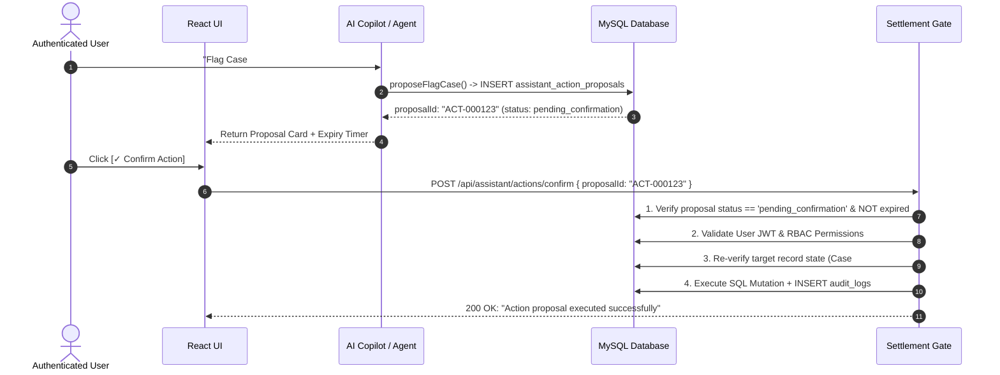

# FinanceFlow AI — Enterprise API Reference & Architecture Specification

**Version:** 1.0.0  
**Status:** Production / Active  
**Base URL (Local):** `http://localhost:5000/api`  
**Base URL (Production):** `https://finance-flow-agent.onrender.com/api`  
**Swagger UI:** `http://localhost:5000/api-docs`  

---

## 1. Overview & System Architecture

FinanceFlow AI is an enterprise financial operations platform powered by **Groq Llama-3.3 70B & Qwen 2.5 32B** multi-agent intelligence. The platform automates payment matching, borrower credit risk scoring, collection notice generation, document intelligence extraction, portfolio analytics, and SLA breach escalation.

### Architecture Highlights
- **Engine**: Node.js ES Modules + Express 4.19
- **Database**: Cloud MySQL 8.0 with InnoDB foreign key constraints and B-Tree indexes
- **Real-Time Layer**: Socket.IO WebSockets for agent status and event broadcasts
- **AI Infrastructure**: Groq SDK function calling with 23 tools + fact-tagging citations
- **Human-in-the-Loop Settlement Gate**: Strict separation between AI analysis and ledger mutations

---

## 2. Human-in-the-Loop Settlement Safety Architecture

> [!IMPORTANT]
> **CRITICAL SECURITY POLICY**: FinanceFlow AI **NEVER** autonomously executes high-risk financial mutations (allocating funds to ledgers, overriding payments, or disbursing capital).



### Safety Principles
1. **Proposal Phase**: AI agents compute candidate matches, confidence scores, and action recommendations, persisting proposals with `pending_confirmation` status.
2. **Review Phase**: Proposals present explicit rationale, target record IDs, old vs. new state diffs, and 15-minute expiration windows.
3. **Execution Phase**: Mutating endpoints (`/api/reconciliations/approve`, `/api/assistant/actions/confirm`) enforce session authentication, RBAC authorization, target state re-verification, and immutable audit log generation (`audit_logs`).

---

## 3. Authentication & Security Schemes

The application supports dual-mode security:

1. **Bearer Token Authentication**:
   - Header: `Authorization: Bearer <jwt_token>`
   - Token validity: 8 hours
   - Signed with `JWT_SECRET`

2. **HTTP-Only Encrypted Cookie**:
   - Cookie Name: `token`
   - Attributes: `HttpOnly`, `SameSite=Strict`, `Secure` (Production)
   - Transmitted automatically by browser CORS `credentials: true` requests

### Security Header Controls
- CORS restricted to whitelisted origin URLs (`http://localhost:5173`, `https://finance-flow-agent.vercel.app`).
- Sensitive environment variables (`GROQ_API_KEY`, `JWT_SECRET`, `DB_PASSWORD`) are never exposed via API endpoints.

---

## 4. Hierarchical Role-Based Access Control (RBAC)

FinanceFlow AI enforces a 7-tier RBAC matrix across all backend endpoints:

| Role ID | Role Name | Display Name | Permissions & Scope |
| :---: | :--- | :--- | :--- |
| `90002` | `owner` | Platform Owner | Full administrative, financial, user creation, model switching, and billing telemetry access. |
| `90003` | `super_admin` | Super Admin | Complete operational control, user management, and AI settings. |
| `1` | `admin` | Operations Admin | Company/loan facility creation, agent execution, user management. |
| `2` | `manager` | Credit Risk Manager | Company/loan creation, portfolio analysis, agent execution, collection dispatch. |
| `3` | `senior_accountant` | Senior Operations | Agent execution, 1-Click human settlement approvals, manual overrides, alert sign-offs. |
| `4` | `accountant` | Daily Operations | Payment ingestion, mock deposit simulation, Agent 1/2/4 test runs. |
| `5` | `viewer` | Read-Only Auditor | Global read-only access across all dashboards; strictly blocked from write mutations and agent triggers. |

---

## 5. API Response Format

All backend REST endpoints return standardized JSON envelopes:

### Success Response (HTTP 200 / 201)
```json
{
  "success": true,
  "message": "Operation completed successfully",
  "data": { ... }
}
```

### Error Response (HTTP 400 / 401 / 403 / 404 / 409 / 410 / 500)
```json
{
  "success": false,
  "message": "Access Restricted: Your current role (Viewer) is read-only.",
  "error": {
    "code": "FORBIDDEN",
    "details": ["Role 'viewer' is prohibited from executing POST /api/payments/ingest"]
  }
}
```

---

## 6. The 6 Operational AI Agents

| Agent ID | Agent Name | Primary Responsibility | Trigger Endpoint(s) | HTTP Method | Minimum Allowed Role |
| :--- | :--- | :--- | :--- | :---: | :--- |
| `agent_1_reconciliation` | Payment Reconciliation Agent | Fuzzy matches incoming bank deposits against loan schedules using Groq Llama-3.3 70B. | `/api/reconciliations/analyze/:caseId`<br>`/api/reconciliations/analyze-bulk` | `POST` | `accountant` |
| `agent_2_risk` | Credit Risk Assessment Agent | Evaluates borrower payment velocity, overdue days, and exposure to compute Default Probability. | `/api/risk/assess/:companyId` | `GET` | `accountant` |
| `agent_3_collection` | Collection Strategy Agent | Generates tailored escalation notices and legal recovery letters under Section 138 NI Act. | `/api/collections/generate/:companyId`<br>`/api/collections/send` | `GET`<br>`POST` | `senior_accountant` |
| `agent_4_document` | Document Intelligence Agent | Extracts loan contract terms, payment proofs, and bank statement line items. | `/api/documents/extract/:documentId` | `POST` | `accountant` |
| `agent_5_portfolio` | Portfolio Intelligence Agent | Computes portfolio-wide health metrics, concentration risk, and macroeconomic projections. | `/api/portfolio/analyze` | `POST` | `manager` |
| `agent_6_notification` | Notification & Escalation Agent | Performs SLA breach scans and routes multi-tier escalation alerts to managers & executives. | `/api/notifications/escalate` | `POST` | `manager` |

---

## 7. Financial Copilot API & 23 Autonomous Tools

The Financial Copilot (`POST /api/assistant/chat`) provides natural language interaction over database facts using 23 registered function-calling tools:

### Read Tools (19 Fact Retrieval Tools)
1. `getPaymentDetails` — Inspects specific raw deposit records
2. `getReconciliationCase` — Fetches AI matching confidence & reasoning
3. `getAgentRun` — Retrieves agent execution run metadata
4. `getAgentExecutionLogs` — Step-by-step LLM tool invocation traces
5. `getLatestAgentRuns` — Recent activity feed across agents
6. `getCompanyProfile` — Borrower details, active loans, risk status
7. `getActiveLoan` — Primary loan facility for a borrower
8. `getLoanDetails` — Full repayment installment breakdown
9. `getRepaymentHistory` — Historical paid vs. overdue installments
10. `searchCompanyByName` — Multi-entity fuzzy name search
11. `getAgentRunsByCase` — All agent recommendations for a case
12. `queryOverdueCompanies` — Filters borrowers exceeding overdue thresholds
13. `getHighRiskBorrowers` — Ranks top delinquent corporate borrowers
14. `getMonthlyCollectionSummary` — Monthly scheduled vs. collected totals
15. `getDocumentSummary` — Document metadata & extracted OCR terms
16. `getPendingCasesForUser` — Role-customized daily priority queue
17. `getPortfolioSummary` — Aggregate portfolio exposure & efficiency
18. `getOverduePayments` — List of all past-due installments
19. `getTokenUsageSummary` — Groq token telemetry & cost breakdown

### Controlled Action Proposal Tools (4 Human-in-the-Loop Tools)
20. `proposeFlagCase` — Generates action proposal to update case priority (`low`, `medium`, `high`, `critical`)
21. `proposeAddCaseNote` — Generates action proposal to append auditor note
22. `proposeTriggerReanalysis` — Generates action proposal to re-run Agent 1/2
23. `proposeEscalateAlert` — Generates action proposal to route Agent 6 escalation notice

---

## 8. Real-Time Socket.IO WebSocket Specification

**Connection Endpoint:** `ws://localhost:5000` or `wss://finance-flow-agent.onrender.com`  
**Transport:** WebSocket / Polling fallback  

### Emitted Real-Time Events
1. `PAYMENT_INGESTED` — Emitted when a new bank deposit is ingested into `payments` table.
2. `RECONCILIATION_STARTED` — Emitted when Agent 1 starts matching analysis.
3. `RECONCILIATION_COMPLETED` — Emitted when Agent 1 finishes analysis and outputs a match confidence score.
4. `RISK_ASSESSMENT_COMPLETED` — Emitted when Agent 2 completes borrower risk grading.
5. `COLLECTION_DRAFTED` — Emitted when Agent 3 generates a draft collection notice.
6. `PORTFOLIO_SNAPSHOT_READY` — Emitted when Agent 5 completes macroeconomic analysis.
7. `ESCALATION_SCAN_COMPLETE` — Emitted when Agent 6 finishes scanning SLA breaches.
8. `NEW_ESCALATION_ALERTS` — Emitted when new critical alerts are created in `notification_alerts`.
9. `notification:alert` — Emitted when an action proposal triggers real-time alert updates.

---

## 9. Comprehensive REST API Endpoint Inventory (43 Endpoints)

### 1. Health Check
- `GET /api/health` — Returns server status and current timestamp. (Public)

### 2. Authentication & User Management
- `POST /api/auth/login` — User login & JWT cookie issuance. (Public)
- `POST /api/auth/logout` — Invalidates JWT session. (Authenticated)
- `GET /api/auth/me` — Fetches current user profile and role. (Authenticated)
- `GET /api/auth/demo-users` — Pre-configured credentials list. (Public)
- `POST /api/auth/set-password` — Sets password via token link. (Public)
- `GET /api/auth/users` — List platform users. (Authenticated)
- `POST /api/auth/users/create` — Create user & send setup link. (Authenticated: `owner`, `super_admin`, `admin`)

### 3. Borrowing Companies Master Data
- `GET /api/companies` — List borrowing companies. (Authenticated)
- `GET /api/companies/:id` — Get company profile by ID. (Authenticated)
- `POST /api/companies` — Register new borrowing company. (Authenticated: `owner`, `super_admin`, `admin`, `manager`)
- `PUT /api/companies/:id` — Update company profile details. (Authenticated: `owner`, `super_admin`, `admin`, `manager`)

### 4. Loan Facilities & Repayments
- `GET /api/loans` — List active loan contracts. (Authenticated)
- `GET /api/loans/:id` — Get loan contract & schedule by ID. (Authenticated)
- `POST /api/loans` — Issue loan facility & generate schedule. (Authenticated: `owner`, `super_admin`, `admin`, `manager`)
- `GET /api/repayments/due` — Get overdue / upcoming installments. (Authenticated)
- `GET /api/repayments/loan/:loanId` — Get schedule for specific loan. (Authenticated)

### 5. Payment Ingestion Engine
- `POST /api/payments/ingest` — Ingest raw bank deposit & open case. (Authenticated: non-viewer)
- `POST /api/payments/mock-bank-deposit` — Simulate live bank deposit. (Authenticated: non-viewer)
- `GET /api/payments` — List ingested bank deposits. (Authenticated)
- `GET /api/payments/:id` — Get payment transaction details. (Authenticated)

### 6. Reconciliation & Settlement Gate (Agent 1)
- `GET /api/reconciliations/stats` — Dashboard KPIs & accuracy. (Authenticated)
- `GET /api/reconciliations/cases` — List reconciliation cases. (Authenticated)
- `GET /api/reconciliations/cases/:caseId` — Get case details. (Authenticated)
- `GET /api/reconciliations/allocations` — List official ledger allocations. (Authenticated)
- `POST /api/reconciliations/analyze/:caseId` — Run Agent 1 on single case. (Authenticated: non-viewer)
- `POST /api/reconciliations/analyze-bulk` - Run Agent 1 on selected cases. (Authenticated: non-viewer)
- `POST /api/reconciliations/analyze-all-pending` — Run Agent 1 on all pending cases. (Authenticated: non-viewer)
- `POST /api/reconciliations/approve` — Approve recommendation & allocate funds. (Authenticated: `senior_accountant`+)
- `POST /api/reconciliations/reject` — Reject recommendation. (Authenticated: `senior_accountant`+)
- `POST /api/reconciliations/override` — Manual accountant override allocation. (Authenticated: `senior_accountant`+)

### 7. Credit Risk Assessment (Agent 2)
- `GET /api/risk/overview` — Portfolio credit risk breakdown. (Authenticated)
- `GET /api/risk/assess/:companyId` — Run Agent 2 credit risk scoring. (Authenticated: non-viewer)

### 8. Collection Strategy & Notices (Agent 3)
- `GET /api/collections/generate/:companyId` — Run Agent 3 collection notice draft. (Authenticated: `senior_accountant`+)
- `POST /api/collections/send` — Approve & dispatch collection email. (Authenticated: `senior_accountant`+)

### 9. Document Intelligence (Agent 4)
- `GET /api/documents` — List document repository files. (Authenticated)
- `POST /api/documents/extract/:documentId` — Run Agent 4 Document Extraction. (Authenticated: non-viewer)

### 10. Agent Control Center
- `GET /api/agents/status` — Live status of 6 AI agents. (Authenticated)
- `GET /api/agents/activity` — System-wide recent agent activity feed. (Authenticated)
- `GET /api/agents/:agentId/runs` — Run history for specific agent. (Authenticated)
- `GET /api/agents/:agentId/runs/:runId` — Step-by-step tool logs. (Authenticated)

### 11. Portfolio Intelligence (Agent 5)
- `POST /api/portfolio/analyze` — Run Agent 5 portfolio analysis. (Authenticated: `manager`+)
- `GET /api/portfolio/snapshots` — Portfolio snapshot history. (Authenticated)
- `GET /api/portfolio/latest` — Latest portfolio snapshot. (Authenticated)

### 12. Notification & Escalation Center (Agent 6)
- `POST /api/notifications/escalate` — Run Agent 6 SLA breach scan. (Authenticated: `manager`+)
- `GET /api/notifications/alerts` — List escalation alerts. (Authenticated)
- `PUT /api/notifications/alerts/:id/approve` — Approve escalation notice. (Authenticated: `senior_accountant`+)
- `PUT /api/notifications/alerts/:id/dismiss` — Dismiss escalation alert. (Authenticated: `senior_accountant`+)

### 13. Settings & Infrastructure Telemetry
- `GET /api/settings` — Get user & system settings. (Authenticated)
- `PUT /api/settings` — Save configuration settings. (Authenticated)
- `GET /api/settings/token-usage` — Groq token telemetry & costs. (Authenticated: `owner`, `super_admin`)
- `PUT /api/settings/active-model` — Switch live Groq LLM model. (Authenticated: `owner`, `super_admin`)

### 14. AI Copilot & Action Proposals
- `POST /api/assistant/chat` — Copilot query & tool execution. (Authenticated)
- `GET /api/assistant/wake/:recordType/:recordId` — Pre-load context badge. (Authenticated)
- `POST /api/assistant/actions/confirm` — Confirm & execute action proposal. (Authenticated)
- `POST /api/assistant/actions/dismiss` — Dismiss action proposal. (Authenticated)

### 15. Audit Logs
- `GET /api/audit-logs` — List compliance audit trail records. (Authenticated: non-viewer)

---

## 10. End-to-End Operational Workflows

### Workflow 1: Authentication & RBAC Session Flow
```
POST /api/auth/login { email, password }
  ↓
Backend validates bcrypt hash
  ↓
Sets HTTP-only JWT Cookie ('token')
  ↓
Frontend issues GET /api/auth/me
  ↓
Receives user profile + role ('senior_accountant')
```

### Workflow 2: Payment Ingestion & Settlement
```
POST /api/payments/ingest { transaction_id, amount, payment_date }
  ↓
Creates Payment #101 (status: 'unmatched')
  ↓
Opens Reconciliation Case #16 (status: 'open')
  ↓
POST /api/reconciliations/analyze/16
  ↓
Agent 1 computes 98.5% match against Schedule #10
  ↓
Senior Accountant clicks [Approve & Allocate]
  ↓
POST /api/reconciliations/approve { recommendationId: 12 }
  ↓
Ledger Entry created in payment_allocations
  ↓
Installment marked PAID & Audit Log logged
```

### Workflow 3: Financial Copilot Action Proposal Confirmation
```
User asks: "Flag Case #16 as critical priority."
  ↓
POST /api/assistant/chat
  ↓
Groq calls proposeFlagCase(caseId: 16, priority: "critical", reason: "SLA breach")
  ↓
Inserts row into assistant_action_proposals (status: 'pending_confirmation')
  ↓
Returns Proposal Card ACT-000123 to UI
  ↓
User clicks [Confirm Action]
  ↓
POST /api/assistant/actions/confirm { proposalId: "ACT-000123" }
  ↓
Backend re-validates case state & permissions
  ↓
UPDATE reconciliation_cases SET priority = 'critical' WHERE id = 16
  ↓
Inserts Audit Log & emits Socket.IO event 'notification:alert'
```

---

## 11. Database Entity Dictionary (18 Tables)

1. `roles` — Access roles (`owner`, `super_admin`, `admin`, `manager`, `senior_accountant`, `accountant`, `viewer`)
2. `users` — User credentials, bcrypt hashes, activation status, reset tokens
3. `companies` — Corporate borrower master profiles & contact details
4. `loans` — Loan facility contracts, principal, interest rates
5. `repayment_schedules` — Scheduled monthly installment breakdown per loan
6. `payments` — Raw incoming bank deposits
7. `reconciliation_cases` — Investigation cases for payments
8. `ai_recommendations` — Agent 1 match candidate records
9. `payment_allocations` — Official ledger allocation records
10. `documents` — Document file metadata and OCR storage
11. `audit_logs` — Immutable compliance audit log
12. `notifications` — System notification queue
13. `agent_runs` — Agent execution metadata (tokens, duration, confidence)
14. `agent_execution_logs` — Detailed tool invocation steps per agent run
15. `portfolio_snapshots` — Agent 5 macroeconomic health snapshots
16. `notification_alerts` — Agent 6 SLA breach escalation notices
17. `user_settings` — Key-value user preference store
18. `assistant_action_proposals` — Human-in-the-Loop action proposals queue

---

## 12. Security & Credentials Protection Summary

- **Secrets Isolation**: No environment keys (`GROQ_API_KEY`, `JWT_SECRET`, `DB_PASSWORD`) are returned by any API endpoint.
- **Strict Input Validation**: Sanitize and validate path parameters, query parameters, and request body payloads.
- **Audit Traceability**: All mutating endpoints append a record to `audit_logs` capturing `user_id`, `action`, `entity_type`, `entity_id`, `old_values`, `new_values`, and client `ip_address`.
